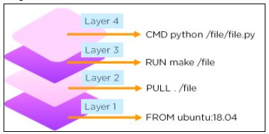
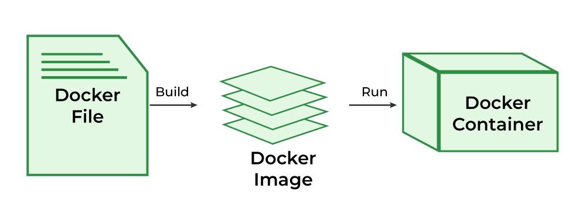
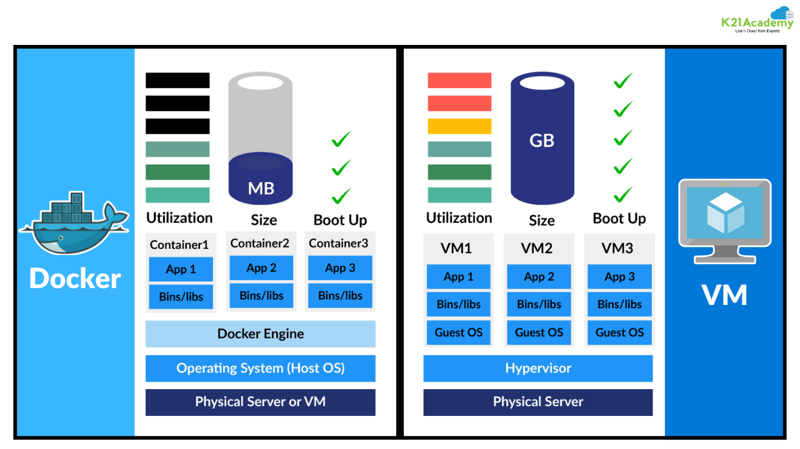
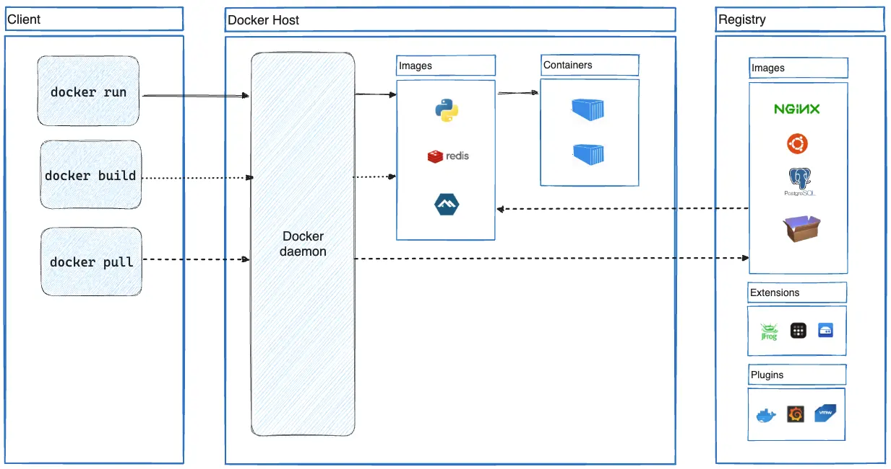

**DOCKER NOTES
**
WHAT IS DOCKER ?

Docker is an **open-source containerization platform** that allows
developers to **build, ship, and run applications** in isolated
environments called **containers**.

WHAT ARE CONTAINERS?

A **container** is like a **small box** where your application lives
along with everything it needs (like libraries, configuration, runtime,
etc.).\
Because of this, the application will **run the same everywhere** --- on
your laptop, another computer, or a cloud server.

Also defined as **RUNNING INSTANCE OF AN IMAGE**.

WHAT IS IMAGE?

Docker image is a template used to create an containers.

WHAT IS DOCKER FILE?

A docker file is a text file that is used to build an image with a set
of instructions.

VOLUME

A volume is a storage method in Docker used to save data so it is not
lost when a container stops or is removed.

VIRTUAL MACHINE

Virtual machine is like a computer inside the computer.

SAMPLE IMAGE OF DOCKER FILE

{width="3.9375in"
height="1.96875in"}

DOCKER FILE\--\>IMAGE\--\>CONTAINER

{width="6.5in"
height="2.3541666666666665in"}DIFFERENCE BETWEEN THE DOCKER & VIRTUAL
MACHINE

{width="6.5in"
height="3.65625in"}

  -----------------------------------------------------------------------------------
                   Docker container                           VM
  ---------------- ------------------------------------------ -----------------------
  What is it?      Docker is a software platform to create    An emulation of a
                   and run Docker containers. A Docker        physical
                   container is an emulation of a user-space  machine---including
                   instance, the part of the operating system virtualized
                   where user processes run.                  hardware---running an
                                                              operating system.

  Virtualization   Container abstracts operating system       VM abstracts hardware
                   details from the application code.         details from the
                                                              application code.

  Objective        Abstract hardware details and increase     Improve application
                   hardware utilization.                      environment management
                                                              and bring consistency
                                                              across multiple
                                                              environments.

  Managed by       The Docker Engine coordinates between the  The hypervisor
                   operating system and Docker containers.    coordinates between the
                                                              machine's physical
                                                              hardware and virtual
                                                              machines.

  Architecture     Shares resources with the underlying host  Runs its own kernel and
                   kernel.                                    operating system.

  Resource sharing On-demand.                                 A fixed amount, set in
                                                              a virtual machine
                                                              image's configuration
                                                              requirements.
  -----------------------------------------------------------------------------------

BARE METAL

Bare metal refers to physical hardware where the operating system runs
directly on the physical server, with out any virtualization layer.

Ex: it's like using computer directly without sharing it.

Simple words: an operating system that is directly installed on the
hardware without hypervisors or virtual machines.

WHY IS DOCKER USED:

It solved one of the biggest problem "its working on my machine, but not
on yours"

DOCKER ENSURES;

PORTABILITY: we can move containers anywhere laptop\--\>
server\--\>cloud.

CONSISTENCY: The app runs the same in the development, testing, and
production.

ISOLATION: Each containers run independently (no conflicts between the
apps).

SPEED: The containers starts faster than the virtual machines.

WHERE IS DOCKER USED?

Software development -- for creating consistent environments.

Testing -- to test applications in different configurations easily.

Deployment -- for CI/CD (Continuous Integration/Deployment) pipelines.

Cloud computing -- almost every major cloud (AWS, Azure, GCP) supports
Docker.

Microservices architecture -- running multiple small services
independently.

OCI-**O**pen **C**ontainer **I**nitiative

It is a standard that defines how container images and container
runtimes should be built and executed.

Why was OCI created?

Before OCI was created different companies were creating their own
container formats which results to an incompatibility.

So to solve this many companies came together and created OCI so that
all containers follow the same rules.

So OCI makes sure that containers built using the docker can run any
where in Kubernetes or cloud platforms.

WHAT ARE UNDERLYING TECHNOLOGIES IN DOCKER?

Actually the docker follows the several Linux kernel features that
provide isolation, resource control, and file system layering.

NAMESPACES

Namespaces make each container feel like it is running on its own
independent system, even though multiple containers share the same host
OS.

Namespaces in Docker ensure that each container has **its own isolated
environment**.\
They control **what a container can *see*** in the system, such as:

-   its own **process list**

-   its own **network (IP & ports)**

-   its own **file system**

-   its own **hostname**

-   its own **users and permissions**

This isolation prevents one container from interfering with another or
with the host system.

CGROUPS(control groups):

Cgroups are responsible for how much resources does an container can
use.

They limit:

-   **CPU usage**

-   **RAM (Memory) usage**

-   **Disk I/O**

-   **Network bandwidth**

So one container **cannot take all system resources** and crash other
containers.

UNION FILE SYSTEM

A **Union File System** allows **multiple layers of files** to be
combined into a **single view**.

Docker **uses this to build images in layers**.

Best example: Berger it contains multiple layers but overall we call it
as burger

Namespaces → What a container can SEE

cgroups → What a container can USE

UnionFS → How files are STORED and SHARED in layers

CONTAINERD

**containerd** is a **container runtime manager** that handles the
**complete lifecycle** of containers.

It is responsible for:

-   Pulling images

-   Managing container storage

-   Starting and stopping containers

-   Managing container networks

-   Talking to lower-level runtimes (like runc)

Runc:

**runc** is a **low-level container runtime** that actually **creates
and runs containers** according to the **OCI (Open Container Initiative)
runtime specification.**

**DOCKER ARCHITECTURE**

{width="6.5in"
height="3.4270833333333335in"}

BASIC DOCKER COMMANDS

-   docker pull \<image\>: Download an image from a registry, like
    Docker Hub.

-   docker build -t \<image name\> \<path\>: Build an image from a
    Docker file, where \<path\> is the directory containing the Docker
    file.

-   docker image ls: List all images available on your local machine.

-   docker run -d -p \<host port\>:\<container port\> \--name
    \<container name\> \<image\>: Run a container from an image, mapping
    host ports to container ports.

-   docker container ls: List all running containers.

-   docker container stop \<container\>: Stop a running container.

-   docker container rm \<container\>: Remove a stopped container.

-   docker image rm \<image\>: Remove an image from your local machine.

DATA PERSISTENCE

**Data Persistence** in Docker means storing data in a way that it
**remains available even after the container is stopped, restarted, or
deleted.**

By default, data inside a container is **temporary** and gets
**deleted** when the container is removed.\
So we use **persistent storage methods** to **keep the data safe**.

WHY DO WE NEED DATA PERSISTENCE

Because containers are:

-   **Ephemeral** (temporary)

-   **Stateless** by default

If a container stores data **only inside itself**, the data disappears
when:

-   Container stops

-   Container restarts

-   Container is recreated (which happens often in deployments)

### **Example:**

If a **MySQL container** stores database data inside itself →\
Deleting the container → **all database tables are lost**

So we need persistence to **protect data**

**EPHEMERAL CONTAILER FILE SYSTEM\--\>**in every container there is
temporary writable layer any file saved there it will be lost if the
container stops running.

Here the docker provide two ways to make the data persistent\
Volume mount, Bind mounts

A **Volume** is a storage space created and managed by Docker **outside
the container**.

### **Why Use?**

-   Prevent data loss

-   Works well with databases & production apps

-   Containers can be removed without losing data

# Create a volume

docker volume create myvolume

# List all volumes

docker volume ls

# **I**nspect a volume (see where it is stored)

docker volume inspect myvolume

# Remove a specific volume

docker volume rm myvolume

# Remove all unused volumes

docker volume prune

# Run a container and attach a volume

docker run -d -v myvolume:/data busybox

# Run a container with a bind mount (host folder → container folder)

docker run -d -v /path/on/host:/path/in/container nginx

Check volume usage in the container

docker inspect container_name

BIND MOUNTS:

Bind Mounts use a **specific directory on your host machine** and map it
into the container.

### **Why Use?**

-   Useful during **development**

-   Supports **hot reloading**

# When to Use Which

  ------------------------------------------------------------------------
  **Situation**                **Use**   **Why**
  ---------------------------- --------- ---------------------------------
  **Development**              Bind      Code changes reflect instantly
                               Mount     

  **Production / Databases**   Volume    Safe, stable, Docker-managed

  **Sharing data between       Volume    Multiple containers can use same
  containers**                           storage
  ------------------------------------------------------------------------

# Using Third-Party Container Images

### **Definition**

These are **pre-built container images** available on registries like:

-   **Docker Hub**

-   GitHub Container Registry

-   AWS ECR

-   GCP GCR

# **Running Containers**

The docker run command creates and starts containers from images in one
step. It combines docker create and docker start operations, allowing
you to execute applications in isolated environments with various
configuration options like port mapping, volumes, and environment
variables.

DOCKER RUN

docker run is used to **start a single container** from a Docker image.

### Meaning:

It runs **one container at a time**.

### **When to Use docker run:**

  -----------------------------------------------------------------------
  **Situation**                                   **Use docker run?**
  ----------------------------------------------- -----------------------
  Running a single app/service                    Yes

  Quick testing                                   Yes

  Local small projects                            Yes

  Running multiple services together (app +       Hard / Complicated
  database)                                       
  -----------------------------------------------------------------------

DOCKER COMPOSE

docker compose is used to **run multiple containers together**, using a
configuration file called **docker-compose.yml**.

### Meaning:

It manages **multi-container applications** with a **single command**.

In this every thing it runs as a service

### When to Use docker compose:

+--------------------------------------------+-------------------------+
| **Situation**                              | **Use docker compose?** |
+============================================+=========================+
| App needs **multiple services** (web +     | Yes                     |
| database + cache)                          |                         |
+--------------------------------------------+-------------------------+
| Need to **start/stop entire application**  | Yes                     |
| easily                                     |                         |
+--------------------------------------------+-------------------------+
| Development / Testing environment          | Yes                     |
+--------------------------------------------+-------------------------+
| Deployment to production                   | Yes (with Kubernetes    |
|                                            | later)                  |
| # **Why Docker Compose is Needed?**        |                         |
|                                            |                         |
| ### **🔹 Problem without Compose:**        |                         |
|                                            |                         |
| If you have:                               |                         |
|                                            |                         |
| -   Web container                          |                         |
|                                            |                         |
| -   Database container                     |                         |
|                                            |                         |
| -   Redis container                        |                         |
|                                            |                         |
| You must run all manually with long        |                         |
| commands → **difficult**.                  |                         |
|                                            |                         |
| ### **🔹 Solution with Compose:**          |                         |
|                                            |                         |
| Just run:                                  |                         |
|                                            |                         |
| docker compose up -d                       |                         |
|                                            |                         |
| All containers start **together**,         |                         |
| properly connected.\                       |                         |
| This makes it perfect for **microservices, |                         |
| full stack apps, dev environments,         |                         |
| CI/CD**.                                   |                         |
|                                            |                         |
| # **Where Docker Compose is Used?**        |                         |
|                                            |                         |
| Used commonly in:                          |                         |
|                                            |                         |
| -   Web development (Flask, Django,        |                         |
|     Node.js, React)                        |                         |
|                                            |                         |
| -   Databases (MySQL, MongoDB, PostgreSQL) |                         |
|                                            |                         |
| -   Microservices architecture             |                         |
|                                            |                         |
| -   Local development environments         |                         |
|                                            |                         |
| -   DevOps automation                      |                         |
|                                            |                         |
| -   Running multiple dependent services    |                         |
|                                            |                         |
| # **How Docker Compose Works**             |                         |
|                                            |                         |
| Compose uses a YAML file.\                 |                         |
| The file defines:                          |                         |
|                                            |                         |
| -   services: → containers                 |                         |
|                                            |                         |
| -   image: → Docker Hub images             |                         |
|                                            |                         |
| -   build: → build from Dockerfile         |                         |
|                                            |                         |
| -   ports: → port mapping                  |                         |
|                                            |                         |
| -   volumes: → data persistence            |                         |
|                                            |                         |
| -   environment: → env variables           |                         |
|                                            |                         |
| -   depends_on: → container dependencies   |                         |
|                                            |                         |
| -   networks: → communication between      |                         |
|     containers                             |                         |
|                                            |                         |
| **Default behavior:**\                     |                         |
| Compose creates a new **network** so all   |                         |
| services can talk using service names (not |                         |
| IPs).                                      |                         |
|                                            |                         |
| #                                          |                         |
| **Most Important Docker Compose Commands** |                         |
|                                            |                         |
| ### **▶ Start services**                   |                         |
|                                            |                         |
| docker compose up                          |                         |
|                                            |                         |
| Start in background:                       |                         |
|                                            |                         |
| docker compose up -d                       |                         |
|                                            |                         |
| ### **⏹ Stop services**                    |                         |
|                                            |                         |
| docker compose down                        |                         |
|                                            |                         |
| Remove volumes too:                        |                         |
|                                            |                         |
| docker compose down \--volumes             |                         |
|                                            |                         |
| ### **🔁 Rebuild images + start**          |                         |
|                                            |                         |
| docker compose up \--build                 |                         |
|                                            |                         |
| ### **📦 Build only**                      |                         |
|                                            |                         |
| docker compose build                       |                         |
|                                            |                         |
| ### **🔍 View running services**           |                         |
|                                            |                         |
| docker compose ps                          |                         |
|                                            |                         |
| ### **Execute inside a container**         |                         |
|                                            |                         |
| docker compose exec \<service\> bash       |                         |
+--------------------------------------------+-------------------------+

# What are Container Registries?

A **Container Registry** is a **storage and distribution system** for
**Docker images**.

It is like a **storehouse** where Docker images are **uploaded (push)**
and **downloaded (pull)**.

**In simple words:**\
A Container Registry is a **place where Docker images are stored and
managed.**

#  Why Do We Need Container Registries?

Because applications are shared and deployed across:

-   Developer machines

-   Servers

-   Cloud environments

-   CI/CD pipelines

So, instead of sending code:\
We **package** the application as an **image**, upload it to a registry,
and then download it wherever needed.

# Two Types of Container Registries

  -----------------------------------------------------------------------------
  **Type**       **Examples**                        **Use**
  -------------- ----------------------------------- --------------------------
  **Public       Docker Hub, Quay.io                 Anyone can pull images
  Registries**                                       

  **Private      **AWS ECR**, **GCP GCR**, **Azure   Used inside companies to
  Registries**   ACR**, **GitHub GHCR**, **JFrog     store private images
                 Artifactory**                       securely
  -----------------------------------------------------------------------------

#  Popular Container Registries

  ------------------------------------------------------------------------
  **Registry**          **Full Form**                  **Provider**
  --------------------- ------------------------------ -------------------
  **Docker Hub**        Default public registry        Docker

  **ECR**               Elastic Container Registry     AWS

  **GCR**               Google Container Registry      Google Cloud

  **ACR**               Azure Container Registry       Microsoft Azure

  **GHCR**              GitHub Container Registry      GitHub

  **JFrog Artifactory** Enterprise image repository    JFrog
  ------------------------------------------------------------------------

# How It Works (Push & Pull)

### Upload to registry:

docker push \<registry\>/\<image_name\>:\<tag\>

### Download from registry:

docker pull \<registry\>/\<image_name\>:\<tag\>

Example:

docker pull nginx

This **pulls nginx image** from Docker Hub to your system.

# Image Tagging Best Practice

Always tag image versions:

myapp:v1\
myapp:v2

Avoid using:

latest

because it can cause confusion about versions in deployment.

# Building Container Images

A **container image** is a *package* that contains:

-   Your application code

-   Required dependencies

-   Libraries

-   System tools

-   Runtime environment

When you run an image → it becomes a **container**.

To build images in Docker, we use **Dockerfiles**.

## Docker files

A **Docker file** is a **text file** that has step-by-step
**instructions** for building an image.

### Example Dockerfile:

FROM python:3.10 \# Base Image\
WORKDIR /app \# Set working directory inside container\
COPY requirements.txt . \# Copy dependencies file\
RUN pip install -r requirements.txt \# Install dependencies\
COPY . . \# Copy application code\
CMD \[\"python\", \"main.py\"\] \# Command to run when container starts

### Key Instructions:

  -----------------------------------------------------------------------
  **Instruction**    **Purpose**
  ------------------ ----------------------------------------------------
  **FROM**           Select a base image

  **WORKDIR**        Set working directory

  **COPY**           Copy files into image

  **RUN**            Execute commands while building image

  **CMD**            Command to run when container starts
  -----------------------------------------------------------------------

## Efficient Layer Caching

Docker builds images **in layers** --- each instruction in the Docker
file creates a **new layer**.

Why does this matter?

**Docker reuses layers when building**, so rebuilding is faster.

### Example:

If only your source code changed, Docker will **reuse** the earlier
layers (like installing dependencies), **saving time**.

FROM python ← Layer 1 (cached)\
RUN pip install .. ← Layer 2 (cached)\
COPY . . ← Only this part rebuilds

### Benefits:

-   Faster builds

-   Saves disk storage

-   Improves CI/CD pipeline speed

##  Image Size and Security

### Image Size Matters

Smaller images:

-   Pull faster

-   Deploy faster

-   Use less disk space

### How to reduce size:

  -----------------------------------------------------------------------
  **Strategy**                         **Example**
  ------------------------------------ ----------------------------------
  Use minimal base images              python:slim, alpine

  Remove unnecessary files             .dockerignore file

  Avoid installing unused tools        Only install what app needs
  -----------------------------------------------------------------------

### Image Security

A secure image must be:

-   Free of vulnerabilities (scan before use)

-   Built from **trusted base images**

-   Not running as **root** inside the container

### Best Practices:

  -----------------------------------------------------------------------
  **Practice**                **Reason**
  --------------------------- -------------------------------------------
  Use official images         They are tested & safe

  Keep image updated          Fixes vulnerabilities

  Do not embed secrets        Never store passwords inside image

  Run as non-root user        Improves security
  -----------------------------------------------------------------------

DOCKER CLI

Docker CLI is the command-line tool used to interact with the Docker
Daemon for managing images, containers, networks, and volumes.

how it works internally

You (developer)

↓ commands

Docker CLI (docker command)

↓ talks to

Docker Daemon (dockerd)

↓ controls

Images, Containers, Networks, Volumes

## Hot Reloading

### What it is:

Hot Reloading means when you **change your source code**, the changes
**automatically reflect** inside the running container **without
rebuilding** the image.

### How it works:

Usually done with **Bind Mounts** (mapping local folder to container
folder):

docker run -v /mycode:/app myimage

### Why it helps:

  -----------------------------------------------------------------------
  **Before Docker**                    **With Hot Reloading**
  ------------------------------------ ----------------------------------
  Change code → Rebuild → Restart      Change code → Instantly reflected
  container → Time waste               → Fast development

  -----------------------------------------------------------------------

Hot Reload = Faster coding

## Debuggers

### What it is:

Debuggers let developers **pause code execution**, check variable
values, and step through code **inside the container**.

### How it works:

Expose debugger port from container → IDE connects to it.\
Example:

docker run -p 5678:5678 myapp

### Why it helps:

-   Makes debugging inside container **the same as local machine**

-   No need to run code outside Docker

**Debugger = Easy bug fixing.**

## Tests Inside Containers

### What it is:

Running tests **inside Docker** ensures the application behaves the
**same** in:

-   Developer laptop

-   Test environment

-   Production servers

Testing in containers=Reliability + No environment mismatch

## Continuous Integration (CI)

### What it is:

CI means every time code is pushed to GitHub/GitLab:

-   The system **automatically** builds the app,

-   Runs tests,

-   Scans images,

-   And confirms the code is safe to deploy.

### Tools:

-   GitHub Actions

-   GitLab CI/CD

-   Jenkins

-   Bitbucket Pipelines

### Why it helps:

-   No need to test manually

-   Ensures code quality

-   Prevents bugs from going to production

**CI = Automated testing + Code quality protection.**

# **Deploying Containers**

Once we build and run containers, the next step is **deploying** them on
servers or cloud.\
But in real applications, we usually have **many containers** (web app,
database, cache, API services, etc.).

We need tools to **manage, scale, restart, load balance, and monitor**
these containers.

These tools are called **container orchestrators**.

## **Nomad**

Nomad is a **simple and lightweight container orchestration tool**
created by HashiCorp.

### Key points:

-   Easier to learn than Kubernetes

-   Can run **containers and non-container workloads**

-   Works well with **Consul** and **Vault**

-   Good for small-to-medium companies

### Where it\'s used:

-   Internal applications

-   Flexible environments

##  **Docker Swarm**

Docker Swarm is **Docker's built-in orchestration tool**.

### Key points:

-   Very easy to set up

-   Uses **Docker CLI** commands (so familiar)

-   Provides clustering + load balancing

-   But not as powerful or flexible as Kubernetes

### When to use:

  -----------------------------------------------------------------------
  **Company size**                     **Recommendation**
  ------------------------------------ ----------------------------------
  Small teams                          Swarm fits well

  Enterprise / Production              Prefer Kubernetes
  -----------------------------------------------------------------------

## **Kubernetes (K8s) --- *Most Important***

Kubernetes is the **industry standard** for container orchestration.

### **Key points:**

-   Automatically **starts / stops / restarts containers**

-   Can **scale up/down containers** based on load

-   Provides **self-healing** (if container crashes, Kubernetes restarts
    it)

-   Supports advanced **networking and security**

-   Works across **cloud platforms** (AWS, Azure, GCP)

### **Used by:**

-   Google

-   Netflix

-   Amazon

-   Almost every large company

### **When to use:**

  -----------------------------------------------------------------------
  **Scale**                             **Use**
  ------------------------------------- ---------------------------------
  Small applications                    Might be overkill

  Medium to Large systems               Kubernetes is best
  -----------------------------------------------------------------------

## **PaaS Options (Platform as a Service)**

Instead of managing infrastructure yourself, you can let **cloud
platforms** run containers for you.

Examples:

  ---------------------------------------------------------------------------
  **Service**           **Provider**   **Description**
  --------------------- -------------- --------------------------------------
  AWS Elastic Beanstalk Amazon         Deploy apps without worrying about
                                       servers

  Google Cloud Run      Google         Runs containers serverlessly

  Azure App Service     Microsoft      Direct container deployment

  AWS ECS (Fargate)     Amazon         Serverless containers (no servers to
                                       manage)
  ---------------------------------------------------------------------------

### **Why use PaaS?**

-   No need to configure servers

-   Automatic scaling

-   Faster deployment

**ORCHESTRATION:** Arranging or managing multiple things in a proper
order so that everything works together smoothly to produce a good
result.

# **Docker Swarm -- What It Does**

**Docker Swarm allows you to connect multiple servers (nodes) together
to form one cluster**, and then **run containers across all those
servers as if they were on a single machine.**

This means you can have:

  -----------------------------------------------------------------------
  **Node Type**          **Purpose**
  ---------------------- ------------------------------------------------
  **Manager Node**       Makes decisions & controls the cluster

  **Worker Nodes**       Actually run the containers
  -----------------------------------------------------------------------

So **Swarm turns many servers → into one big virtual Docker host**.

#  **Why is This Useful?**

Because:

-   You can **deploy multiple containers across multiple servers**

-   You can **scale applications easily**

-   You get **high availability** (if one machine goes down, others take
    over.

<https://docs.docker.com/get-started/docker_cheatsheet.pdf> docker
commands

