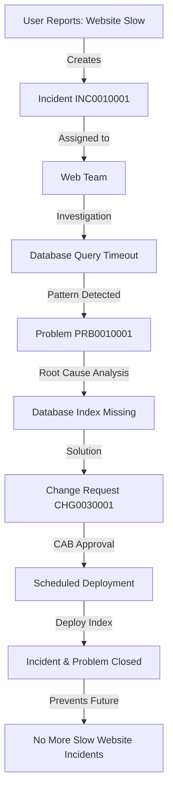

# ServiceNow Ecosystem Guide
## A Technical Deep-Dive for Enterprise Workflow Automation

---

## Table of Contents
- [The Big Picture](#the-big-picture)
- [Core Modules: The 4 Pillars](#core-modules-the-4-pillars)
- [Technical Architecture](#technical-architecture)
- [ServiceNow vs. The World](#servicenow-vs-the-world)
- [The Learning Journey](#the-learning-journey)
- [Frequently Asked Questions](#frequently-asked-questions)
- [Glossary](#glossary)

---

## The Big Picture

### What is ServiceNow?

**ServiceNow** is a cloud-based **enterprise platform** that digitizes and automates workflows across an entire organization. It's often called the **"Platform of Platforms"** because it doesn't just solve one problem—it orchestrates workflows across IT, HR, Customer Service, Security, and even custom business processes.

Think of it as the **"digital air traffic control"** for your enterprise—every request, incident, change, or task flows through a unified system with visibility, automation, and governance.

### Why "Platform of Platforms"?

```
Traditional Approach:
┌──────────────┐  ┌──────────────┐  ┌──────────────┐  ┌──────────────┐
│   IT Tools   │  │  HR Systems  │  │   CRM Tools  │  │ Custom Apps  │
│   (Silos)    │  │   (Silos)    │  │   (Silos)    │  │   (Silos)    │
└──────────────┘  └──────────────┘  └──────────────┘  └──────────────┘
      ↓                  ↓                  ↓                  ↓
  No Integration    Different UX      Duplicate Data    Manual Handoffs


ServiceNow Approach:
                    ┌─────────────────────────────┐
                    │   ServiceNow Platform       │
                    │  (Unified Workflows)        │
                    └─────────────────────────────┘
                              ↓
        ┌──────────────┬──────────────┬──────────────┬──────────────┐
        │     ITSM     │     HRSD     │     CSM      │   Custom     │
        │  (IT Flows)  │  (HR Flows)  │ (Service)    │   Workflows  │
        └──────────────┴──────────────┴──────────────┴──────────────┘
                    Single Data Model (CMDB)
                    Common UX & Automation
```

### System of Record vs. System of Action

| Concept | Description | Example |
|---------|-------------|---------|
| **System of Record** | The **authoritative source** of truth for data. It stores information but doesn't necessarily act on it. | A traditional CMDB that just stores server configurations. |
| **System of Action** | A platform that **takes action** based on data. It triggers workflows, approvals, and automation. | ServiceNow auto-creates incidents when a server goes down, assigns to teams, and tracks resolution. |

**ServiceNow is BOTH**: It stores the "golden record" (CMDB) AND orchestrates actions (workflows, approvals, integrations).

> **Architect Tip:** ServiceNow shines when you need to connect **people, systems, and data** in automated workflows. If you're just storing data (like a database), you're using 10% of its power.

---

## Core Modules: The 4 Pillars

ServiceNow's strength lies in its **pre-built modules** that follow industry best practices (primarily ITIL). Here are the foundational pillars:

### 1. ITSM (IT Service Management)

**What It Does:**  
ITSM is the **backbone** of ServiceNow. It manages the entire IT service lifecycle based on **ITIL** (Information Technology Infrastructure Library) best practices.

**Key Processes:**

| Process | Purpose | Real-World Use Case |
|---------|---------|---------------------|
| **Incident Management** | Restore normal service as quickly as possible | User reports "Email is down" → Ticket created → Assigned to L1 → Escalated to Exchange team → Resolved in 2 hours. |
| **Problem Management** | Identify root causes and prevent incidents | After 5 "Email down" incidents in a month, Problem record created → Root cause: failing mail server → Permanent fix implemented. |
| **Change Management** | Control changes to minimize risk | Deploy new ERP system → Change Request (CR) created → Approval workflow → CAB (Change Advisory Board) review → Scheduled deployment → Post-implementation review. |
| **Request Management** | Handle service requests (non-incidents) | Employee requests "New laptop" → Catalog item → Approval from manager → Procurement → Fulfillment → Delivery. |

#### Real-World Use Case: Incident to Problem to Change



> **Architect Tip:** Incidents are **symptoms**. Problems are **diseases**. Changes are **cures**. ServiceNow connects all three automatically.

---

### 2. ITOM (IT Operations Management)

**What It Does:**  
ITOM provides **visibility and automation** for IT infrastructure. It answers: "What do we have?" and "Is it working?"

**Key Components:**

| Component | Purpose | Real-World Use Case |
|-----------|---------|---------------------|
| **Discovery** | Automatically finds and maps infrastructure (servers, apps, network devices) | Discovery agent scans network → Finds 500 servers → Auto-populates CMDB with OS, CPU, memory, installed software. |
| **Service Mapping** | Shows how services depend on infrastructure | Maps "E-commerce Website" → Depends on: Web servers, App servers, Database, Load balancer → If DB goes down, automatically know website is impacted. |
| **Event Management** | Monitors alerts from tools (Datadog, Nagios, etc.) and auto-creates incidents | Datadog alerts: "CPU > 90%" → ServiceNow receives event → Auto-creates Incident → Assigns to server team. |

#### Real-World Use Case: Automated Incident Creation

```
Step 1: Server CPU hits 95%
   ↓
Step 2: Monitoring tool (Datadog/Nagios) sends alert to ServiceNow
   ↓
Step 3: Event Management receives alert
   ↓
Step 4: Event correlation: "Is this a known issue?"
   ↓
Step 5: No duplicate found → Auto-create Incident INC0010045
   ↓
Step 6: Assignment rules: "Server alerts go to Infrastructure Team"
   ↓
Step 7: Incident assigned to John Doe (on-call engineer)
   ↓
Step 8: John receives SMS/Email notification
   ↓
Step 9: John logs in, sees server details from CMDB
   ↓
Step 10: John restarts service → Incident auto-closes when CPU normalizes
```

> **Architect Tip:** ITOM transforms "reactive firefighting" into "proactive operations." Discovery keeps CMDB accurate, Service Mapping shows impact, and Event Management automates incident creation.

---

### 3. HRSD (HR Service Delivery)

**What It Does:**  
HRSD brings **IT service management principles** to Human Resources. Instead of HR handling requests via email/spreadsheets, employees use a **self-service portal**.

**Key Processes:**

| Process | Purpose | Real-World Use Case |
|---------|---------|---------------------|
| **Employee Onboarding** | Automate new hire setup | New hire "Alice Smith" starts Monday → HR creates case → Triggers workflows: IT creates accounts (AD, email, laptop), Facilities assigns desk, Manager schedules orientation → All tracked in one place. |
| **Case Management** | Handle HR requests (PTO, benefits, complaints) | Employee submits "Request remote work approval" → Routed to manager → Manager approves → HR updates policy → Employee notified. |
| **Knowledge Base** | Self-service articles (FAQs) | Employee searches "How to change 401k contribution?" → Finds article → Self-resolves without HR ticket. |

#### Real-World Use Case: Employee Onboarding Workflow

```
Day -7 (Before Start Date):
   ↓
HR creates Employee record in ServiceNow
   ↓
Automated workflow triggers:
   ├─> IT: Create AD account, email, VPN access
   ├─> IT: Order laptop (Dell XPS 15)
   ├─> Facilities: Assign desk on Floor 3
   ├─> Payroll: Set up direct deposit
   └─> Manager: Schedule 1-on-1 meeting
   ↓
Day 0 (Start Date):
   ├─> Laptop delivered to desk
   ├─> Welcome email sent with credentials
   ├─> HR sends onboarding checklist
   └─> Manager receives notification: "Alice's first day!"
   ↓
Day 1-30:
   └─> Track completion: Training videos, policy sign-offs, benefits enrollment
```

> **Architect Tip:** HRSD reduces "Time to Productivity" for new hires. Instead of waiting weeks for access, everything is automated and tracked.

---

### 4. CSM (Customer Service Management)

**What It Does:**  
CSM connects **customer-facing teams** (support, sales) with **back-office teams** (IT, operations). It's ServiceNow's answer to Salesforce Service Cloud.

**Key Features:**

| Feature | Purpose | Real-World Use Case |
|---------|---------|---------------------|
| **Case Management** | Track customer issues end-to-end | Customer reports "Product defect" → Case created → Routed to QA team → QA finds bug → Creates Incident for Dev team → Bug fixed → Customer notified → Case closed. |
| **Field Service Management** | Manage on-site technicians | Customer's printer broken → Dispatch technician → Technician uses mobile app to view customer history, parts needed → On-site fix → Customer signs off → Invoice generated. |
| **Omnichannel Support** | Handle customers across email, chat, phone | Customer emails "Refund request" → Agent responds via chat → Creates return in backend system → All interactions logged in one Case. |

#### Real-World Use Case: Customer Issue to Internal Fix

```
Customer Portal:
   ↓
Customer submits: "Login not working on mobile app"
   ↓
CSM creates Case #CS0001234
   ↓
Agent investigates → Finds it's a known bug
   ↓
Agent creates linked Incident (INC0010055) for Development team
   ↓
Dev team fixes bug → Deploys via Change Request (CHG0030012)
   ↓
Agent notified of fix → Updates customer
   ↓
Customer confirms login works → Case closed
   ↓
Post-resolution survey sent → Customer rates 5 stars
```

> **Architect Tip:** CSM breaks down silos between "front office" (customer support) and "back office" (IT/operations). One case can trigger workflows across multiple departments.

---

## Technical Architecture

### The CMDB: The Heart of ServiceNow

The **Configuration Management Database (CMDB)** is the **single source of truth** for all IT assets and their relationships.

**What's in the CMDB?**

| CI Type (Configuration Item) | Examples |
|------------------------------|----------|
| **Hardware** | Servers, laptops, routers, switches, printers |
| **Software** | Applications, databases, operating systems |
| **People** | Employees, vendors, teams |
| **Services** | E-commerce website, Email service, CRM application |
| **Locations** | Data centers, offices, cloud regions |
| **Relationships** | "Web Server 01" **runs on** "VMware Host 05" **located in** "US-East-1" **supports** "E-commerce Service" |

#### CMDB Relationship Example

```
E-commerce Website (Business Service)
   ↓ Depends On ↓
┌─────────────────────────────────────┐
│  Load Balancer (AWS ELB)            │
└─────────────────────────────────────┘
   ↓ Distributes to ↓
┌──────────────┬──────────────┬──────────────┐
│ Web Server 1 │ Web Server 2 │ Web Server 3 │
└──────────────┴──────────────┴──────────────┘
   ↓ Connects to ↓
┌─────────────────────────────────────┐
│  Application Server (Tomcat)        │
└─────────────────────────────────────┘
   ↓ Queries ↓
┌─────────────────────────────────────┐
│  Database Server (PostgreSQL)       │
└─────────────────────────────────────┘
   ↓ Hosted On ↓
┌─────────────────────────────────────┐
│  AWS EC2 Instance                   │
└─────────────────────────────────────┘
```

**Why is the CMDB Important?**

1. **Impact Analysis**: If Database Server goes down → Automatically know E-commerce Website is impacted.
2. **Change Planning**: Before changing Load Balancer → See all dependent services → Plan maintenance window.
3. **Incident Resolution**: Incident on Web Server 1 → Instantly pull server details (OS, patches, owner) from CMDB.
4. **Compliance**: Audit all software licenses, track hardware refresh cycles.

> **Architect Tip:** A **dirty CMDB** (inaccurate data) is worse than no CMDB. Use Discovery (ITOM) to auto-populate and keep it accurate. Manual updates ALWAYS fail at scale.

---

### The Now Platform: Building Blocks

The **Now Platform** is the foundation on which all ServiceNow modules are built. It provides:

#### 1. Flow Designer (Low-Code Automation)

**What It Does:** Visual workflow builder (like Zapier, but enterprise-grade).

**Example Workflow:**
```
Trigger: New Incident created with Priority = "Critical"
   ↓
Action 1: Send Slack message to #incidents channel
   ↓
Action 2: Create Zoom meeting link
   ↓
Action 3: Send SMS to on-call engineer
   ↓
Action 4: Update Incident with meeting link
   ↓
Action 5: If not resolved in 30 min → Escalate to Manager
```

**When to Use:**
- ✅ Automate repetitive tasks (90% of workflows)
- ✅ Integrate with external systems (Slack, Jira, Salesforce)
- ❌ Complex business logic (use scripting instead)

---

#### 2. IntegrationHub

**What It Does:** Pre-built **connectors** to 3rd-party systems (like Zapier's integrations).

**Popular Integrations:**

| System | Use Case |
|--------|----------|
| **Slack** | Send incident notifications to channels |
| **Jira** | Sync development tasks with ServiceNow changes |
| **AWS** | Auto-discover EC2 instances, trigger workflows on CloudWatch alerts |
| **Microsoft Teams** | Collaborate on incidents within Teams |
| **Salesforce** | Sync customer cases between CSM and Salesforce |
| **Datadog** | Receive monitoring alerts and auto-create incidents |

**Example Integration:**
```
ServiceNow Incident Created (Priority = Critical)
   ↓
IntegrationHub → Slack Spoke
   ↓
Slack Message: "@channel Critical Incident INC0010001: Production DB Down"
   ↓
Team clicks link → Opens Incident in ServiceNow
```

---

#### 3. Service Portal (Employee/Customer Self-Service)

**What It Does:** Customizable web portals where users can:
- Submit requests (e.g., "Request new laptop")
- Search knowledge articles
- Track ticket status
- Chat with virtual agents (AI chatbots)

**Example:**
```
Employee Portal (Employee Service Center):
   ├─> HR Requests (PTO, benefits)
   ├─> IT Requests (Reset password, software access)
   ├─> Facilities (Report broken AC)
   └─> Knowledge Base (Self-service articles)

Customer Portal:
   ├─> Submit support tickets
   ├─> Track order status
   ├─> Chat with support bot
   └─> View product documentation
```

> **Architect Tip:** A well-designed Service Portal reduces ticket volume by 30-50%. Users self-resolve via Knowledge articles or automated chatbots.

---

### Scripting in ServiceNow

ServiceNow uses **JavaScript** for customization. There are two main scripting types:

| Script Type | Runs On | Use Cases | Example |
|-------------|---------|-----------|---------|
| **Client Scripts** | User's Browser (Client-Side) | Real-time form validation, dynamic field changes | When user selects "Hardware" category → Show "Model" field. |
| **Business Rules** | Server (Database) | Automated actions on record insert/update/delete | When Incident Priority = "Critical" → Auto-assign to Senior Engineer. |

#### Example: Client Script (Field Validation)

```javascript
// Client Script: Validate email format before form submission
function onSubmit() {
  var email = g_form.getValue('email');
  var emailRegex = /^[^\s@]+@[^\s@]+\.[^\s@]+$/;
  
  if (!emailRegex.test(email)) {
    g_form.addErrorMessage('Please enter a valid email address');
    return false; // Prevent form submission
  }
  return true; // Allow submission
}
```

#### Example: Business Rule (Auto-Assignment)

```javascript
// Business Rule: Auto-assign Critical Incidents to "Tier 3 Support"
(function executeRule(current, previous /*null when async*/) {
  
  if (current.priority == '1') { // Priority 1 = Critical
    current.assignment_group = '4e8b9e0e4f1234000001'; // Tier 3 Support group
    current.assigned_to = getSeniorEngineer(); // Custom function
  }
  
})(current, previous);
```

**When to Use Each:**

| Scenario | Client Script | Business Rule |
|----------|---------------|---------------|
| Show/hide fields based on selection | ✅ | ❌ |
| Validate data before saving | ✅ | ❌ |
| Auto-populate fields from database | ❌ | ✅ |
| Send email notifications | ❌ | ✅ |
| Create related records | ❌ | ✅ |
| Update CMDB relationships | ❌ | ✅ |

> **Architect Tip:** **Client Scripts** improve user experience (instant feedback). **Business Rules** enforce business logic (data integrity, automation). Never do heavy database queries in Client Scripts—it slows down the UI.

---

## ServiceNow vs. The World

### Comparison Table

| Feature | **ServiceNow** | **Jira Service Management** | **Salesforce Service Cloud** |
|---------|----------------|----------------------------|------------------------------|
| **Primary Use Case** | Enterprise IT & Business Workflows | DevOps & IT Service Desk | Customer Service & Sales |
| **ITSM (ITIL)** | ⭐⭐⭐⭐⭐ Industry-leading | ⭐⭐⭐⭐ Strong | ⭐⭐ Basic |
| **CMDB** | ⭐⭐⭐⭐⭐ Best-in-class | ⭐⭐ Limited (Assets) | ❌ None |
| **Automation** | ⭐⭐⭐⭐⭐ Flow Designer, IntegrationHub | ⭐⭐⭐⭐ Automation rules | ⭐⭐⭐⭐ Process Builder, Flow |
| **Developer Experience** | ⭐⭐⭐ Moderate (requires training) | ⭐⭐⭐⭐⭐ Developer-friendly | ⭐⭐⭐ Salesforce-specific skills |
| **Cost** | $$$$ (Enterprise pricing) | $$ (Affordable for SMBs) | $$$ (Per-user + add-ons) |
| **Integration Ecosystem** | ⭐⭐⭐⭐ 500+ integrations | ⭐⭐⭐⭐⭐ 5000+ via Marketplace | ⭐⭐⭐⭐ AppExchange |
| **Customization** | ⭐⭐⭐⭐⭐ Highly flexible | ⭐⭐⭐ Moderate | ⭐⭐⭐⭐ Very flexible |
| **Learning Curve** | ⭐⭐ Steep (ITIL + Platform) | ⭐⭐⭐⭐ Easy (Jira-familiar) | ⭐⭐⭐ Moderate (CRM background helps) |
| **Best For** | Large enterprises (5000+ employees) | SMBs, DevOps teams | Sales-driven orgs, B2C companies |

---

### The "Sweet Spot": When to Use ServiceNow

#### ✅ ServiceNow is the RIGHT Choice When:

1. **Enterprise Scale**: 1000+ employees, complex multi-department workflows
2. **ITIL Compliance Required**: Government, healthcare, finance (strict governance)
3. **Need Single Platform**: Consolidate IT, HR, Customer Service, Security workflows
4. **Complex Infrastructure**: Thousands of servers, apps, network devices → Need CMDB
5. **Heavy Integrations**: Must connect 20+ systems (Slack, AWS, AD, SAP, etc.)
6. **Audit & Compliance**: Need detailed change logs, approval trails, SLA tracking

**Example Scenario:**
> "We're a Fortune 500 bank with 50,000 employees, 10,000 servers, and strict compliance requirements. We need to track every change, incident, and request with full audit trails. We also want to automate onboarding and integrate with 30+ legacy systems."  
> **→ ServiceNow is PERFECT.**

---

#### ❌ ServiceNow is OVERKILL When:

1. **Small Team**: <100 employees, simple workflows
2. **Budget Constraints**: Startup with limited funding
3. **Simple Ticketing**: Just need basic incident tracking (no CMDB, no automation)
4. **Developer-Centric**: Team already lives in Jira/GitHub
5. **Low Customization Needs**: Out-of-the-box tool suffices

**Example Scenario:**
> "We're a 50-person startup. We just need a ticketing system for customer support and bug tracking."  
> **→ Use Zendesk or Jira Service Management instead.**

---

### Head-to-Head Comparison

```
Scenario: "We need an IT Service Desk for 500 employees."

Option 1: ServiceNow
   ├─ Cost: ~$100/user/year = $50,000/year
   ├─ Setup Time: 3-6 months (requires customization)
   ├─ Features: ITSM, CMDB, automation, integrations
   └─ Best If: Need CMDB, complex workflows, future expansion

Option 2: Jira Service Management
   ├─ Cost: ~$20/user/year = $10,000/year
   ├─ Setup Time: 1-2 weeks (quick start)
   ├─ Features: Ticketing, automation, Confluence integration
   └─ Best If: DevOps-focused, cost-conscious, simple workflows

Option 3: Salesforce Service Cloud
   ├─ Cost: ~$75/user/year = $37,500/year
   ├─ Setup Time: 1-3 months
   ├─ Features: Customer service, CRM integration, AI chatbots
   └─ Best If: Already use Salesforce CRM, customer-facing service desk
```

> **Architect Tip:** ServiceNow is an **investment, not an expense**. If you commit to it, you'll save millions in process efficiency over 5 years. But if you just need basic ticketing, you're paying for a Ferrari when a Honda would do.

---

## The Learning Journey

### Getting a PDI (Personal Developer Instance)

A **PDI** is a **free, fully-functional ServiceNow instance** for learning and experimentation.

**How to Get One:**

1. **Go to**: [https://developer.servicenow.com](https://developer.servicenow.com)
2. **Sign Up**: Create a free account
3. **Request Instance**: Click "Request Instance" → Choose latest version (e.g., "Vancouver")
4. **Wait 2-3 minutes**: Your instance spins up
5. **Access**: You'll get a URL like `https://dev12345.service-now.com`
6. **Login**: 
   - Username: `admin`
   - Password: (you set during signup)

**What You Can Do with a PDI:**

- ✅ Explore ALL modules (ITSM, HRSD, CSM, ITOM)
- ✅ Build custom applications
- ✅ Practice scripting (Client Scripts, Business Rules)
- ✅ Test integrations (Slack, AWS, etc.)
- ✅ Take certification practice exams
- ❌ Use in production (it resets every 10 days of inactivity)

> **Architect Tip:** Your PDI is your **sandbox**. Break things, experiment, and rebuild. It's the fastest way to learn without consequences.

---

### Top 3 Certifications for Beginners

| Certification | Full Name | What It Covers | Who Should Take It |
|---------------|-----------|----------------|-------------------|
| **CSA** | Certified System Administrator | ITSM basics, UI configuration, workflows, reports | **Everyone** starting with ServiceNow (Entry-level) |
| **CAD** | Certified Application Developer | Scripting (JavaScript), custom apps, advanced workflows | Developers, technical consultants |
| **CIS-ITSM** | Certified Implementation Specialist (ITSM) | Deep dive into Incident, Problem, Change, CMDB | ITSM implementers, solution architects |

---

#### Certification Roadmap

```
Entry Level (0-6 months):
   ↓
┌─────────────────────────────┐
│  CSA (System Administrator) │ ← Start Here
└─────────────────────────────┘
   ↓
Intermediate (6-12 months):
   ↓
┌──────────────────────┬──────────────────────┐
│  CAD (Developer)     │  CIS-ITSM            │ ← Pick your path
│  (Technical)         │  (Functional)        │
└──────────────────────┴──────────────────────┘
   ↓
Advanced (12-24 months):
   ↓
┌────────────────────────────────────────────┐
│  CTA (Technical Architect)                 │ ← Expert Level
│  OR Specialist Certs (ITOM, HRSD, CSM)     │
└────────────────────────────────────────────┘
```

---

### 90-Day Learning Roadmap

#### **Month 1: Foundations (CSA Prep)**

| Week | Focus Area | Activities |
|------|------------|------------|
| **Week 1** | Platform Basics | - Request PDI<br>- Explore UI (lists, forms, filters)<br>- Create sample Incident, Change, Problem records |
| **Week 2** | ITSM Core | - Study Incident workflow<br>- Configure Assignment Rules<br>- Create Knowledge Articles |
| **Week 3** | Automation | - Build Flow Designer workflow (e.g., auto-email on Incident creation)<br>- Create Notifications |
| **Week 4** | Reporting | - Build custom reports (Incident trends, SLA compliance)<br>- Create dashboards<br>- **Take CSA practice exam** |

**Resources:**
- Official ServiceNow Learning: [NowLearning](https://nowlearning.servicenow.com)
- YouTube: "ServiceNow Basics" by ServiceNow Developers
- Community: [ServiceNow Community Forums](https://community.servicenow.com)

---

#### **Month 2: Intermediate Skills (Developer Track)**

| Week | Focus Area | Activities |
|------|------------|------------|
| **Week 5** | Scripting Fundamentals | - Learn JavaScript basics (if needed)<br>- Write first Client Script (field validation)<br>- Write first Business Rule (auto-assignment) |
| **Week 6** | CMDB & Discovery | - Manually create CIs (servers, applications)<br>- Define CI relationships<br>- Explore Service Mapping |
| **Week 7** | Integrations | - Set up Slack integration (send Incident alerts)<br>- Build REST API endpoint<br>- Test with Postman |
| **Week 8** | Custom Applications | - Use Studio to build custom app (e.g., "Asset Request")<br>- Create custom tables, forms<br>- **CAD prep begins** |

**Resources:**
- Official Docs: [ServiceNow Docs](https://docs.servicenow.com)
- Scripting: "ServiceNow Scripting" by Chuck Tomasi (book)
- Practice: Build 3-5 mini-projects (e.g., "Leave Management System")

---

#### **Month 3: Specialization & Certification**

| Week | Focus Area | Activities |
|------|------------|------------|
| **Week 9** | Advanced Workflows | - Multi-level approvals<br>- Conditional workflows<br>- SLA & OLA configuration |
| **Week 10** | Performance & Best Practices | - Optimize Business Rules (avoid N+1 queries)<br>- ACL (Access Control) security<br>- Update Sets & version control |
| **Week 11** | Mock Exams | - Take 3 full CSA practice exams<br>- Review weak areas<br>- Join study groups |
| **Week 12** | Certification | - **Schedule & pass CSA exam**<br>- Update LinkedIn with certification<br>- Start CAD or CIS prep |

---

### Recommended Learning Path by Role

```
Role: IT Service Desk Agent
   ↓
Learn: ITSM basics, Incident/Request handling, Knowledge Base
Certification: CSA
Timeline: 1-2 months

Role: Developer / Technical Consultant
   ↓
Learn: Scripting, Flow Designer, IntegrationHub, Custom Apps
Certification: CSA → CAD
Timeline: 3-6 months

Role: Solution Architect
   ↓
Learn: CMDB design, ITOM, Multi-domain workflows, Governance
Certification: CSA → CAD → CIS → CTA
Timeline: 12-24 months

Role: HR Professional (using HRSD)
   ↓
Learn: HR Service Delivery, Case Management, Employee Portal
Certification: CSA (optional: CIS-HRSD)
Timeline: 2-3 months
```

> **Architect Tip:** Don't rush certifications. **Hands-on experience** beats certifications every time. Build real projects in your PDI—employers value "I built a custom app" over "I passed an exam."

---

## Frequently Asked Questions

### General Questions

#### Q1: Is ServiceNow SaaS or On-Premise?
**A:** ServiceNow is **100% SaaS (cloud-based)**. There is NO on-premise version. Everything runs on ServiceNow's cloud infrastructure.

**Why cloud-only?**
- Automatic upgrades (2 major releases per year)
- No infrastructure management
- High availability (99.9% uptime SLA)
- Global data centers

---

#### Q2: How much does ServiceNow cost?
**A:** Pricing is **NOT public** and varies based on:
- Number of users
- Modules enabled (ITSM, HRSD, CSM, etc.)
- Contract length (1-year vs. 3-year)
- Add-ons (IntegrationHub, ITOM, APM)

**Rough Estimates (per user/year):**
- ITSM Only: $100-150
- ITSM + HRSD: $150-200
- Full Suite (ITSM + HRSD + CSM + ITOM): $200-300+

**For 1000 users:**
- Basic: ~$100,000/year
- Full Suite: ~$250,000+/year

> **Note:** Always negotiate with ServiceNow sales. Discounts are common for multi-year deals.

---

#### Q3: What's the difference between a "Fulfiller" and a "Requester"?
**A:**

| Role | Description | License Cost | Example |
|------|-------------|--------------|---------|
| **Requester** | End-users who SUBMIT tickets but don't resolve them | Free or low-cost | Employees requesting laptops, customers submitting support tickets |
| **Fulfiller** | Agents/admins who WORK ON and RESOLVE tickets | Full license ($100-300/year) | IT support agents, HR case managers, developers |

**Important:** You only pay full price for **Fulfillers**. Requesters are often included free or at minimal cost.

---

#### Q4: Can ServiceNow replace Jira?
**A:** **Partially**, but not recommended for software development.

| Use Case | Best Tool |
|----------|-----------|
| IT Service Desk (incidents, requests) | ✅ ServiceNow |
| Software Development (sprints, epics, user stories) | ✅ Jira |
| DevOps (CI/CD, deployments) | ✅ Jira + Jenkins/GitLab |
| Enterprise Workflows (HR, Facilities) | ✅ ServiceNow |

**Hybrid Approach (Common):**
- ServiceNow: IT Service Management (incidents, changes)
- Jira: Development teams (agile boards, backlog)
- **Integration:** Sync ServiceNow Changes with Jira Stories via IntegrationHub

> **Architect Tip:** Don't force developers into ServiceNow for agile workflows. They'll resist. Use Jira for dev, ServiceNow for everything else.

---

### Technical Questions

#### Q5: What programming languages do I need to know?
**A:**

| Language/Skill | Usage in ServiceNow | Required? |
|----------------|---------------------|-----------|
| **JavaScript** | Client Scripts, Business Rules, Script Includes | ✅ Yes (most important) |
| **HTML/CSS** | Service Portal customization, UI Pages | ⚠️ Optional (UI customization) |
| **AngularJS** | Service Portal widgets | ⚠️ Optional (advanced UI) |
| **SQL** | NOT used directly (ServiceNow uses GlideRecord API) | ❌ No |
| **REST/SOAP APIs** | Integrations with external systems | ⚠️ Optional (integrations) |

**Bottom Line:** Strong **JavaScript** skills get you 80% of the way. Everything else is bonus.

---

#### Q6: What's the difference between GlideRecord and GlideQuery?
**A:**

| API | When to Use | Performance | Example |
|-----|-------------|-------------|---------|
| **GlideRecord** | Legacy, widely used | ⚠️ Slower (loads all fields) | `var gr = new GlideRecord('incident'); gr.query();` |
| **GlideQuery** | Modern (introduced 2021) | ⚡ Faster (loads only needed fields) | `new GlideQuery('incident').select('number', 'priority').get();` |

**Recommendation:** Use **GlideQuery** for new development. Migrate old scripts gradually.

```javascript
// Old Way (GlideRecord)
var gr = new GlideRecord('incident');
gr.addQuery('priority', '1');
gr.query();
while (gr.next()) {
  gs.info(gr.number);
}

// New Way (GlideQuery)
new GlideQuery('incident')
  .where('priority', '1')
  .select('number')
  .forEach(function(incident) {
    gs.info(incident.number);
  });
```

---

#### Q7: How do ServiceNow upgrades work?
**A:** ServiceNow releases **2 major versions per year**:
- **Spring Release** (April/May)
- **Fall Release** (September/October)

**Release Naming:**
- Alphabetical order by city names
- Examples: Tokyo (2023), Utah (2024), Vancouver (2024), Washington DC (2025)

**Upgrade Process:**
1. ServiceNow announces new release (3-6 months notice)
2. You test in **Preview Instance** (sandbox)
3. Fix any customizations that break
4. Schedule production upgrade window
5. ServiceNow performs upgrade (typically overnight)
6. You validate in production

**Important:**
- Upgrades are **NOT optional**. ServiceNow forces upgrades within 12-18 months.
- Plan for **testing time** (2-4 weeks for large orgs).

---

#### Q8: What's an Update Set?
**A:** An **Update Set** is how you migrate customizations between instances (like Git branches).

**Example Workflow:**
```
Development Instance (DEV):
   ↓
Make changes (new workflow, custom field, etc.)
   ↓
Capture changes in Update Set "US0001234"
   ↓
Export Update Set as XML file
   ↓
Import to Test Instance (TEST)
   ↓
Validate changes work
   ↓
Import to Production (PROD)
   ↓
Commit Update Set
```

**Best Practices:**
- ✅ One Update Set per feature/project
- ✅ Test in lower environments first
- ❌ Don't mix unrelated changes in one Update Set
- ❌ Never edit Update Sets directly in PROD

> **Architect Tip:** For large orgs, consider **Source Control Integration** (Git) instead of Update Sets. It's more powerful but requires DevOps expertise.

---

### Career Questions

#### Q9: What's the salary for ServiceNow professionals?
**A:** (Based on 2024 US market, varies by location/experience)

| Role | Experience | Salary Range |
|------|------------|--------------|
| **ServiceNow Developer** | Entry (0-2 years) | $70,000 - $90,000 |
| **ServiceNow Developer** | Mid (3-5 years) | $90,000 - $120,000 |
| **ServiceNow Architect** | Senior (5-10 years) | $120,000 - $180,000 |
| **ServiceNow Technical Architect (CTA)** | Expert (10+ years) | $180,000 - $250,000+ |
| **ServiceNow Consultant** | Contract (hourly) | $80 - $150/hour |

**High Demand Areas:**
- Healthcare (Epic + ServiceNow integrations)
- Finance (compliance, security)
- Federal government (FedRAMP certified instances)

---

#### Q10: Is ServiceNow a good career choice in 2024-2025?
**A:** **YES**, for several reasons:

**Pros:**
- ✅ **High Demand**: Gartner Magic Quadrant Leader for ITSM (10+ years)
- ✅ **Growing Market**: ServiceNow revenue up 25% YoY
- ✅ **Remote-Friendly**: Many roles are fully remote
- ✅ **Diverse Roles**: Developer, Admin, Architect, Consultant, Business Analyst
- ✅ **Continuous Learning**: New features every 6 months (never boring)

**Cons:**
- ⚠️ **Vendor Lock-In**: Skills are ServiceNow-specific (not easily transferable)
- ⚠️ **Competitive Certifications**: CSA pass rate ~60% (study hard!)
- ⚠️ **Enterprise Focus**: Fewer opportunities at startups/SMBs

**Bottom Line:** If you want a stable, high-paying career in enterprise IT, ServiceNow is an excellent choice.

---

#### Q11: How do I get my first ServiceNow job without experience?
**A:** Classic catch-22: "Need experience to get job, need job to get experience."

**Strategies:**

1. **Get CSA Certified** (proves foundational knowledge)
2. **Build a Portfolio in PDI:**
   - Create 3-5 custom apps (e.g., "Equipment Tracking", "Leave Management")
   - Document on GitHub with screenshots
   - Share on LinkedIn
3. **Contribute to Community:**
   - Answer questions on ServiceNow forums
   - Write blog posts (Medium, Dev.to)
   - Create YouTube tutorials
4. **Target Entry Roles:**
   - ServiceNow Implementation Consultant (at partner firms)
   - Junior Developer (at companies using ServiceNow)
   - IT Service Desk → transition to ServiceNow admin
5. **Network:**
   - Attend ServiceNow Knowledge conference
   - Join local ServiceNow user groups
   - Connect with recruiters on LinkedIn (#ServiceNow #CSA)

> **Architect Tip:** ServiceNow partner firms (Accenture, Deloitte, Cognizant, DXC) hire aggressively and offer training programs for beginners.

---

### Implementation Questions

#### Q12: How long does a ServiceNow implementation take?
**A:** Depends on scope and complexity.

| Scenario | Timeline | Effort |
|----------|----------|--------|
| **Out-of-the-Box ITSM** (small company, <500 users, minimal customization) | 2-3 months | 1-2 consultants |
| **Customized ITSM + CMDB** (mid-size, 1000-5000 users, integrations) | 6-9 months | 3-5 consultants |
| **Enterprise Rollout** (ITSM + HRSD + CSM, 10,000+ users, 50+ integrations) | 12-18 months | 10-20 consultants |
| **Global Deployment** (multi-domain, 100,000+ users, complex governance) | 18-36 months | 20-50 consultants |

**Key Success Factors:**
- Executive sponsorship (budget + authority)
- Dedicated project manager
- Clear scope (avoid scope creep!)
- Change management (train end-users)

---

#### Q13: What are common implementation pitfalls?
**A:**

| Pitfall | Impact | Solution |
|---------|--------|----------|
| **Over-customization** | Upgrades break, maintenance nightmare | Stick to 80/20 rule: 80% out-of-box, 20% custom |
| **Dirty CMDB data** | Wrong impact analysis, poor decisions | Use Discovery (ITOM) for auto-population |
| **Poor change management** | User resistance, low adoption | Train users, communicate value, celebrate wins |
| **Scope creep** | Project delays, budget overruns | Freeze scope after design phase, use phased rollout |
| **Ignoring integrations** | Siloed data, manual workarounds | Plan integrations early (AD, email, monitoring tools) |
| **No governance** | Customizations conflict, chaos | Establish Change Advisory Board (CAB), code reviews |

> **Architect Tip:** **"Out-of-the-box first, customize only when necessary."** Every custom script is future technical debt.

---

## Glossary

| Term | Definition |
|------|------------|
| **ACL** | Access Control List - Security rules that control who can read/write records |
| **ATF** | Automated Test Framework - Built-in testing tool for workflows |
| **Business Rule** | Server-side JavaScript that runs on database operations (insert/update/delete) |
| **CAB** | Change Advisory Board - Group that approves high-risk changes |
| **CI** | Configuration Item - Any component in the CMDB (server, app, etc.) |
| **Client Script** | JavaScript that runs in the user's browser for form validation/UX |
| **CMDB** | Configuration Management Database - Central repository of all IT assets |
| **CSM** | Customer Service Management - Module for customer support workflows |
| **Flow Designer** | Visual workflow builder (low-code automation tool) |
| **GlideRecord** | JavaScript API for querying ServiceNow database tables |
| **HRSD** | HR Service Delivery - Module for HR workflows (onboarding, cases) |
| **Incident** | Unplanned interruption to a service (e.g., server down) |
| **IntegrationHub** | Tool for connecting ServiceNow to external systems (Slack, AWS, etc.) |
| **ITIL** | IT Infrastructure Library - Best practices framework for IT service management |
| **ITOM** | IT Operations Management - Discovery, Event Management, Service Mapping |
| **ITSM** | IT Service Management - Core module (Incident, Problem, Change) |
| **PDI** | Personal Developer Instance - Free ServiceNow instance for learning |
| **Problem** | Root cause of one or more incidents |
| **Script Include** | Reusable server-side JavaScript function library |
| **Service Catalog** | Portal where users request services (e.g., "New laptop") |
| **SLA** | Service Level Agreement - Guaranteed response/resolution time |
| **Spoke** | Pre-built integration in IntegrationHub (e.g., "Slack Spoke") |
| **UI Action** | Button/link on a form (e.g., "Resolve Incident" button) |
| **Update Set** | Package of customizations for migration between instances |

---

## Final Thoughts

ServiceNow is more than a tool—it's a **platform that orchestrates how work gets done** across an entire enterprise. Whether you're tracking IT incidents, onboarding employees, or managing customer cases, ServiceNow provides the framework, automation, and visibility to do it efficiently.

**Key Takeaways:**

1. **Start with ITSM**: Master Incident, Problem, Change. Everything else builds on this.
2. **Leverage CMDB**: It's the foundation. Keep it clean, or everything else fails.
3. **Automate Ruthlessly**: Use Flow Designer, Business Rules, and Integrations to eliminate manual work.
4. **Think Long-Term**: ServiceNow is a 5-10 year investment. Plan for governance, training, and continuous improvement.
5. **Never Stop Learning**: New features every 6 months. Stay curious.

---

**Next Steps:**
1. Request your **PDI** today: [developer.servicenow.com](https://developer.servicenow.com)
2. Take the **free CSA course** on NowLearning
3. Join the **ServiceNow Community** and ask questions
4. Build something in your PDI (even a simple asset tracker)

**Good luck on your ServiceNow journey! 🚀**

---

*Last Updated: February 2024*

**Contribute:** Found an error? Submit a pull request on GitHub!
**Contact:** your-email@example.com

---

## Additional Resources

### Official ServiceNow Resources
- **Developer Portal**: https://developer.servicenow.com
- **Documentation**: https://docs.servicenow.com
- **Learning Platform**: https://nowlearning.servicenow.com
- **Community Forums**: https://community.servicenow.com
- **YouTube Channel**: ServiceNow Developers

### Third-Party Learning
- **Books**:
  - "Learning ServiceNow" by Tim Woodruff
  - "ServiceNow IT Operations Management" by Ajayi Abimbola
  - "Practical ServiceNow Development" by Tim Woodruff
- **Blogs**:
  - ServiceNow Guru: https://www.servicenowguru.com
  - SN Pro Tips: https://snprotips.com
  - Community Blogs: https://community.servicenow.com/community?id=community_blog
- **Courses**:
  - Udemy: "ServiceNow CSA Certification Training"
  - Pluralsight: "ServiceNow Fundamentals"
  - LinkedIn Learning: "ServiceNow Essential Training"

### Certification Resources
- **Official CSA Study Guide**: https://nowlearning.servicenow.com
- **Practice Exams**: ServiceNow Simulator (in PDI)
- **Study Groups**: ServiceNow Community Forums

### Conferences & Events
- **Knowledge (Annual Conference)**: Las Vegas (May) - Must-attend for serious professionals
- **CreatorCon**: For developers and architects
- **Local User Groups**: Search "ServiceNow User Group + [Your City]"

---

**Happy ServiceNow-ing! May your incidents be few and your automations be many! 🎯**
